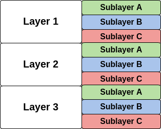

# An Introduction The Windows Filtering Platform

Lately, I've been spending a significant portion of my time interacting with the low-level networking capabilities of Microsoft Windows. Starting with Windows Vista, Microsoft released a framework called the Windows Filtering Platform (WFP for short). It's the core foundation on which the Windows Firewall With Advanced (*haha*) Security is implemented. If you've ever had the unique pleasure of working with a Window's kernel-level API before, chances are you have experienced the overwhelming amount of dedication required to even get 'hello world' working. Navigating the absurd amount of inaccurate, misleading, outdated, incomplete (or whatever you want to call it...) information out there is **hard**.

Although there is a decent bit of information floating around the inter-web about the Windows Filtering Platform, I still found myself *really* struggling to become a master-ninja of the Windows networking stack in any reasonable amount of time. For this reason, I hoping to use this example project and tutorial to accomplish the following:

* Reasonably explain the important architectural components of the Windows Filtering Platform from a conceptual standpoint
* Equip others with the knowledge necessary to use this API effectively
* Provide a *simple* and *useful* example of how to put the pieces of this framework together (the examples provided by Microsoft left me with more questions than answers)
* Provide links to resources and information that I have gathered in a centralized location

## Overview
So why would you want to interact with network traffic from within the Windows kernel anyways? Whether you want to develop the next-generation firewall or launch a network based attack on Windows, here are some common reasons one might want to develop a Windows Filtering Platform driver:

* Modify how network data flows through the windows networking stack
* Add your own rules that determine which network data makes it in and out of Windows (think firewall)
* Inject your own code into the Windows networking stack to provide additional networking functionality
* Capture details about network traffic at a low level (think [Wireshark](https://www.wireshark.org/) )

The Windows Filtering Platform is usually utilized within the context of a kmdf driver, although a limited sub-set can also be used in user-space via umdf. A discussion of kmdf and umdf are outside the scope of this post, so I will assume that you have at least a basic understanding of programing in a Windows driver environment. If not, I strongly urge you to [brush up](http://www.codeproject.com/Articles/9504/Driver-Development-Part-Introduction-to-Drivers) a little on Windows driver concepts before proceeding. For a new-comer (and seasoned pro alike), this can be tricky stuff.

###A Note On Naming Conventions
Many of the functions and data structures that belong to the Windows Filtering Platform use a number as a suffix. This is how Microsoft achieves polymorphism to maintain compatibility between different versions of Windows. This post is aimed at Windows 7, so I will try to reference functions that apply specifically to that version. However, if you are using Visual Studio (which you should be), you should omit the number suffix all together and let Visual Studio choose the correct version based on your project's target-platform settings. 

For example, there are three versions of a classifyFn function. If you wanted to target Windows 7, you need to use the function classifyFn1. To achieve this while writing code in Visual Studio, you would call classifyFn (a macro), and then configure your target platform to Windows 7, causing the macro to resolve to classifyFn1. Got it? Onward!

## Concepts and Architecture

This section aims to provide a high-level overview of the most important components in the Windows Filtering Platform. Once familiar with these concepts, it should become a little easier to approach the detailed (and intimidating) <a href="https://msdn.microsoft.com/en-us/library/windows/desktop/aa366510(v=vs.85).aspx">documentation</a> provided from Microsoft. Lets jump right in...

### Base Filtering Engine
The Base Filtering Engine is the component of the Windows Filtering Platform that Microsoft has already implemented for you. The entire WFP API is centered around interacting with this core component. Writing a driver with the Windows Filtering Platform usually involves registering a series of objects to the Base Filtering Engine, each of which allow you to interact with network traffic in different ways. Filters, Callouts, Layers, and Sublayers are the primary objects that you interact with as the author of a WFP driver. All of these objects 'live inside' the Base Filtering Engine.

### Filters
Microsoft defines a Filter as follows: *A filter defines several filtering conditions for filtering TCP/IP network data and an action that is to be taken on the data if all the filtering conditions are true...* (<a href="https://msdn.microsoft.com/en-us/library/windows/hardware/ff549902(v=vs.85).aspx">source</a>). Hmm... The word 'filter' is used to define iteself 4 times. Maybe I can elaborate: 

A *Filter* is a data structure (<a href="https://msdn.microsoft.com/en-us/library/windows/desktop/aa364265(v=vs.85).aspx">FWPM_FILTER0</a>) that describes a collection of rules (<a href="https://msdn.microsoft.com/en-us/library/windows/desktop/aa364268(v=vs.85).aspx">FWPM_FILTER_CONDITION0</a>) along with an action (<a href="https://msdn.microsoft.com/en-us/library/windows/desktop/aa364248(v=vs.85).aspx">FWPM_ACTION0</a>) to take when all of those rules are satisfied. Think of a filter as the thing that steals network packets out of the network stack and makes a decision about what to do with them. You register a Filter to the Base Filtering Engine with the function <a href="https://msdn.microsoft.com/en-us/library/windows/desktop/aa364046(v=vs.85).aspx">FwpmFilterAdd0</a>(). Once registered, your Filter has the responsibility of dealing with all network traffic that matches its conditions.

### Callouts
Another inferior definition from Microsoft states that *"A callout provides functionality that extends the capabilities of the Windows Filtering Platform. A callout consists of a set of callout functions and a GUID key that uniquely identifies the callout..."* (<a href="https://msdn.microsoft.com/en-us/library/windows/hardware/ff543871(v=vs.85).aspx">source</a>). Thats it? Somehow I'm not satisfied. Lets try again:

A *Callout* is a collection of <a href="https://msdn.microsoft.com/en-us/library/windows/hardware/ff544847(v=vs.85).aspx">3 Functions</a> that a Filter can pass network traffic to accomplish deeper inspection and/or modification of that traffic. In other words, a filter matches network traffic and then delegates its decision-making to a Callout. Callouts are represented by two separate data structures: The <a href ="https://msdn.microsoft.com/en-us/library/windows/hardware/ff551224(v=vs.85).aspx">FWPS_CALLOUT0</a> structure represents the '3 callouts functions' (more on this later), while the <a href="https://msdn.microsoft.com/en-us/library/windows/desktop/aa364250(v=vs.85).aspx">FWPM_CALLOUT0</a> structure represents the 'Callout' as an object to the Base Filtering Engine. Before you can use a Callout, you need to register all of your 'callout functions' using <a href="https://msdn.microsoft.com/en-us/library/windows/hardware/ff551143(v=vs.85).aspx">FwpsCalloutRegister1</a>, and then additionally register a callout structure using the function <a href="https://msdn.microsoft.com/en-us/library/windows/desktop/aa364010(v=vs.85).aspx">FwpmCalloutAdd0</a>.

There are three types of callout functions that each perform a different role relating to a filter that references the callout:

#### ClassifyFn
A callout's <a href="https://msdn.microsoft.com/en-us/library/windows/hardware/ff544887(v=vs.85).aspx">ClassifyFn</a> is what gets called every time a Filter matches a network packet. A ClassifyFn is usually used for the following purposes:

* Inspecting a network packet, along with other attributes that give context to the packet
* Modifying a network packet using the "block/cone/re-inject" method
* Making a decision to either block or permit a packet, or yielding to another filter without making a decision.

ClassifyFn functions get passed the following parameters, which are used for the following purposes:

* <a href="https://msdn.microsoft.com/en-us/library/windows/hardware/ff552401(v=vs.85).aspx">FWPS_INCOMING_VALUES0</a> * inFixedValues - This parameter is just a pointer to an arbitrary list of values. The type and number of values contained here are different depending on which layer of the WFP invoked the callout. Some common values included here are source/destination IP addresses, port numbers, network interface source/destination, and protocol. The values in this list are a little tricky to look up, you need to use a seperate enumeration to index this list for every layer of the WFP. For example, if you want to lookup the remote IP address for a packet that invoked a callout from the Outbound IPV4 Transport layer, you would use the following: 
inFixedValues->incomingValue[FWPS_FIELD_OUTBOUND_TRANSPORT_V4_IP_REMOTE_ADDRESS].value.uint32. A full list of enumertions to index each layer of WFP can be found <a href="https://msdn.microsoft.com/en-us/library/windows/hardware/ff546312(v=vs.85).aspx">here</a>.

* <a href="https://msdn.microsoft.com/en-us/library/windows/hardware/ff552397(v=vs.85).aspx">FWPS_INCOMING_METADATA_VALUES0</a> * inMetaValues - This parameter contains a pointer to a structure that describes contextual clues that describe the purpose of a network packet that invoked a callout. This structure contains things like the direction the packet is traveling (ingress or egress), the size of it's IP and/or TCP headers (if applicable), a security token for an associated user account, etc.

* void * layerData - This parameter points to the actual network packet's location in memory. If you plan on doing any packet modification or deep inspection of a packet's payload, this pointer will lead you in the right direction. When making modifications to a packet, <b>NEVER</b> modify the memory that this pointer leads you to. You must instead follow the "block/cone/reinject" method: Block the original packet, clone the packet using <a href="https://msdn.microsoft.com/en-us/library/windows/hardware/ff551134(v=vs.85).aspx">FwpsAllocateCloneNetBufferList0</a> and <a href="https://msdn.microsoft.com/en-us/library/windows/hardware/ff551206(v=vs.85).aspx">FwpsReferenceNetBufferList0</a>, and then finally use a <a href="https://msdn.microsoft.com/en-us/library/windows/hardware/ff569975(v=vs.85).aspx">packet injection function</a> to reinject the clone back into the network stream. This pattern is *extremely* difficult to get right using the WFP API, so proceed with caution.

* <a href="https://msdn.microsoft.com/en-us/library/windows/hardware/ff552387(v=vs.85).aspx">FWPS_FILTER0</a> * filter - This points the FWPS_FILTER0 structure that invoked this callout. Theoretically, you can reference the same ClassifyFn with multiple filters at different layers. However in practice, I have always found this to be a horrible idea (see Tips section below).

* UINT64 flowContext - This parameter contains data when the Filter that invoked this ClassifyFn is associated with a data-flow and context for that flow. I never deal with WFP data-flows, so I always ignore this parameter.

* <a href="https://msdn.microsoft.com/en-us/library/windows/hardware/ff551229(v=vs.85).aspx">FWPS_CLASSIFY_OUT0</a> * classifyOut - This pointer is used to communicate back to the Base Filtering Engine after a ClassifyFn has returned. The most common task for this pointer is to set the actionType member to either FWP_ACTION_BLOCK or FWP_ACTION_PERMIT. This identifies the ClassifyFn's decision to either block or permit the packet pointed to by layerData. A callout can also yield a decision to another callout using FWP_ACTION_CONTINUE, and additionally provide other permissions to future Callouts using the *rights* and *flags* members of FWPS_CLASSIFY_OUT0.

#### NotifyFn
A Callout's <a href="https://msdn.microsoft.com/en-us/library/windows/hardware/ff568802(v=vs.85).aspx">NotifyFn</a>  function gets called every time a new Filter gets added or removed from the Base Filtering Engine with this callout specified as its action. This function is useful for setting up resources such as globals or worker threads that the ClassifyFn needs access to. Since this function will always be called before a Callout's ClassifyFn, it is a great place to setup the Callout's resources.

#### FlowDeleteFn
A Callout's <a href="https://msdn.microsoft.com/en-us/library/windows/hardware/ff550025(v=vs.85).aspx">FlowDeleteFn</a> gets called under special circumstances when a Filter that references the Callout manages a WFP data-flow. I never deal with WFP data-flows, so my own callouts always use the following as a FlowDeleteFn:

	NTSTATUS EmptyFlowDelete(UINT16 layerId, UINT32 calloutId, UINT64 flowContext)
	{
		return STATUS_SUCCESS;
	}

### Layers, Sublayers and Weights
The Filters described above always operate within the context of a Layer and a Sublayer. *Layers* correspond roughly (and I mean *rough*-ly) to different parts of the <a href="https://en.wikipedia.org/wiki/OSI_model">OSI networking model</a>. *Sublayers* are a construct used by the Base Filtering Engine to facilitate order and fairness between all registered Filters. Before you register any filters, it is your responsibility to create your own sublayer for your filters to live in. Each layer contains *all* sublayers in the Base Filtering Engine. I like the visualize this relationship like this:

 

The Base Filtering Engine uses the concept of a *weight* to determine the order in which filters and sublayers are invoked. Each sublayer has an assigned weight within each layer, and likewise each filter has an assigned weight within a sublayer. Higher weighted sublayers and filters are traversed first, and have the first chance to make a block or permit decision.

Microsoft uses the term *filter arbitration* to refer to the algorithm that computes a block/permit decision within a layer. Fortunately for us, they did a great job <a href="https://msdn.microsoft.com/en-us/library/windows/desktop/aa364008(v=vs.85).aspx">documenting</a> how this process works. I will leave it to the reader to review the specifics.

Here is an overview of some commonly used Windows Filtering Platform layers:

| Layer Name | Description |
| ---------------- | --------------- |
| FWPM_INBOUND_IPPACKET_V4 | As the layer's name indicates, IP packets on the ingress path are indicated to this layer. This layer roughly corresponds to layer 3 of the OSI network model. Inspecting IP packets at this layer won't give you any information about ports yet, because they have not yet crossed a transport layer. |
| FWPM_OUTBOUND_IPPACKET_V4| Like the previous layer, IP packets from layer 3 of the OSI model show up here. However, packets here are on the egress path, have already crossed a transport layer, and thus information about ports is available. |
| FWPM_INBOUND_TRANSPORT_V4 | Packets at this layer represent transport layer traffic on the ingress path (OSI model layer 4). Things like TCP and UDP packets can be inspected here. |
| FWPM_OUTBOUND_TRANSPORT_V4 | Similar to the previous layer, transport layer packets on the egress path are indicated to this layer. |
| FWPM_LAYER_ALE_AUTH_CONNECT_V4 | This is the first of the so-called "ALE layers" of WFP. There is a different ALE layer for each step of the TCP-handshake process. Packets at this layer are all TCP SYN packets on the egress path (the packet that initiates a TCP handshake) |
| FWPM_LAYER_ALE_AUTH_RECV_ACCEPT_V4 | This is the second ALE layer. Ingress TCP SYN packets show up here. If a socket is listening for a TCP connection on the packet's local port, a TCP SYN-ACK packet will be sent from this layer on the egress path. |
| FWPM_LAYER_ALE_FLOW_ESTABLISHED_V4 | This the third ALE layer. Ingress TCP SYN-ACK and ACK packets show up here on the ingress path, and TCP ACK packets are sent out on the egress path from this layer. |

*Note: Each layer also works with IP V6 network traffic, just replace the suffix '_V4' with '_V6'.

There are many other layers of the Windows Filtering Platform: layers that inspect UDP traffic, layers that help process encrypted network traffic (IPSEC), layers that display discarded network traffic (look for the '_DISCARD' suffix), and layers that interact with low-level link layer protocols. You can reference the entire list of available layers <a href="https://msdn.microsoft.com/en-us/library/windows/desktop/aa366492(v=vs.85).aspx">here</a>. Also, a conceptual overview of how the ALE layers work together can be found <a href="https://msdn.microsoft.com/en-us/library/windows/desktop/bb451830(v=vs.85).aspx">here</a> 

## An  Example

To help get you started with the Windows Filtering Platform, I created this sample driver (move up one directory from this README) to accompany this tutorial. This example demonstrates how to register a single Callout, Sublayer, and Filter to the Base Filtering Engine. I tried my best to keep this example as *simple* as possible: the Callout just prints some information (output visible in [DbgView](https://technet.microsoft.com/en-us/sysinternals/debugview.aspx)) about outbound TCP packets, and blocks any packets bound for the remote port 1234.

### Setting Up Your Environment
For this project, I used Visual Studio 2013 and the WDK version 8.1. You will need to download both from Microsoft's web site to build this example (both are free). I used the project template under New Project->Templates->Visual C++->Windows Driver->WDF->Kernel Mode Driver, Empty (KMDF) to get started. Make sure to set your target platform and configuration appropriately (I used the pre-configured Win7 Debug, x64 configuration). If building the driver for a 64-bit Windows version, make sure you disable driver signature enforcement before you install the driver (or sign the driver with your own production certificate). For easy loading and unloading of drivers on Windows, I like to use the [OSR Driver Loader](https://www.osronline.com/article.cfm?article=157) utility.

## Tips From My Experience
The following tips come from my own experience using the WFP API. These are certainly not hard-rules, but rather general practices I follow to help make life easier for myself:

* Implement your Callout's ClassifyFn such that it corresponds to exactly one layer of WFP. It is possible to use the same ClassifyFn for any number of callouts at any number of different layers (in fact, this is the approach Microsoft takes with its examples). *Do not do this!* For example, if you need a ClassifyFn to inspect traffic at the inbound IP_PACKET layers, don't mix in logic to handle packets at the outbound IP_PACKET layers. I have found it useful to have multiple filters referencing the same ClassifyFn only if all filters are registered to the same layer. You have been warned.

* Take great care to double-check and convert between host and network byte-ordering when necessary. For example, an IPV4 address will show up in the inFixedValues parameter of a ClassifyFn in host byte ordering, while it shows up in network byte ordering on the actual packet that invoked the same ClassifyFn. I've been burned by this "feature" on more than one occasion...

* If dealing with the ALE layers, make sure that there are applications/sockets listening on the ports you are requesting to. If a TCP SYN packet shows up on the ingress path with no socket listening for it, it will be discarded at the ***_TRANSPORT_DISCARD layer before it makes it to an ALE layer.

* Proxying a TCP connection on the ingress path is **near imposible** to accomplish with this framework. May God have mercy on your soul if you need to accomplish this. Hopefully one day I will get around to writing another tutorial specifically demonstrating this task. Proxying a connection on the egress path is not as bad (check out the <a href="https://msdn.microsoft.com/en-us/library/windows/hardware/ff571005(v=vs.85).aspx">FWPM_LAYER_ALE_BIND_REDIRECT_V4 and FWPM_LAYER_ALE_CONNECT_REDIRECT_V4</a> layers for that).

## Useful resources
Finally, here is a list of resources I found useful when learning about the Windows Filtering Platform. Some are accurate, some are not. All are incomplete or lack vital information:

* Microsoft's [warnings and considerations](https://msdn.microsoft.com/en-us/library/ff543882.aspx)  when programming with this framework.
* Microsoft's Windows Filtering Platform [Q&A forum](https://social.msdn.microsoft.com/Forums/windowsdesktop/en-US/home?forum=wfp)  has some good discussions.
* Different reasons for implementing callouts, along with some random implementation details can be found [here](https://msdn.microsoft.com/en-us/library/windows/hardware/ff570963%28v=vs.85%29.aspx)
* [This](https://msdn.microsoft.com/en-us/library/gg158944.aspx) page describes where the NDIS-pointer-thing is pointing when you access layerData from a ClassifyFn at different layers.
* The *best* information I could find about performing ingress port redirection can be found [here](https://social.msdn.microsoft.com/Forums/windowsdesktop/en-US/9e762b8c-6106-48b9-944a-7798479b3255/conditions-of-filtering-for-back-traffic-inboundtransportv4?forum=wfp). This is still missing a lot of details, but provides a starting point.
* When performing google-foo to search the web, look for results from "Dusty Harper" and "Biao Wang". Both are Microsoft employees that must play some vital role in the creation and maintenance of the framework. After reading *so* many comments from these guys, I feel like I know them personally.

## Conclusion
I hope this tutorial has helped to demystify some of the complexities behind the Windows Filtering Platform. You should now have the background knowledge necessary to tackle the implementation of your own kernel-level networking tools for Windows. If I have succeeded, hopefully I have spared you many headaches during your ramp-up time with this tool. If I have caused you more headaches, please consider contributing to this repository by sending my a pull request. Thank you for reading, and happy hacking!

